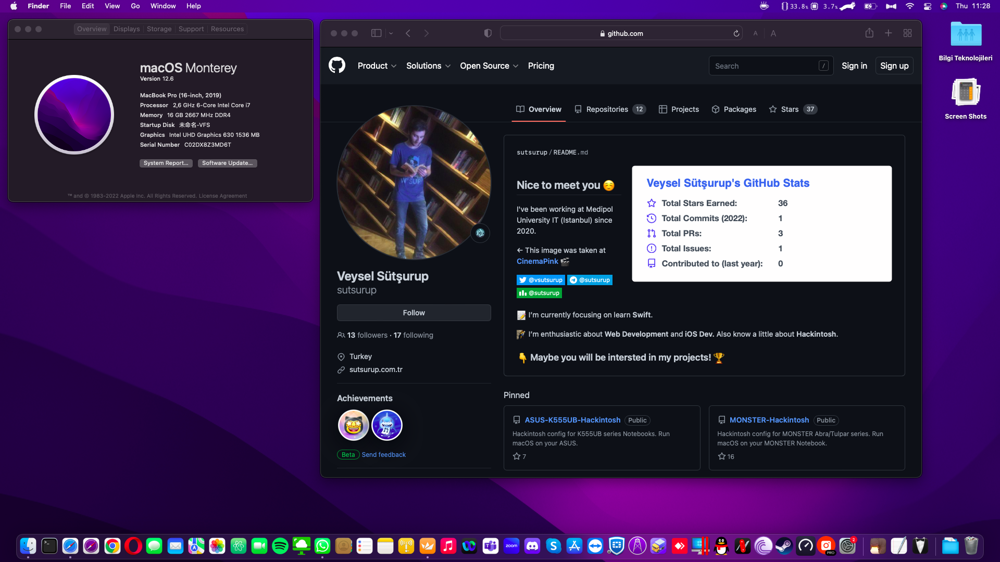

# DELL Latitude 5491 14" | Intel i7 (8850H)

[](https://www.apple.com/tr/macos/monterey/)
[](https://github.com/acidanthera/OpenCorePkg)
[](https://github.com/sutsurup/DELL-Latitude-5491-Hackintosh/releases)


Türkçe | [English](README_EN.md)

**macOS Versiyonu: 12.6**

**OpenCore Versiyonu: 0.8.6**

Yardımcı olabilecek kaynaklar: 

- [OpenCore Yükleme Rehberi](https://dortania.github.io/OpenCore-Install-Guide)


# Detaylar

    Tarih:        1 Aralık 2022
    Durum:        Stabil
    Destek:       BIOS (1.23.0)
    Yapı:         OpenCore

## Donanım

| **DELL** | Detay                                                  |
| ------------------- | ------------------------------------------- |
| Model İsmi      | DELL Latitude 5491      |
| Anakart           | 	DELL 0VGJ22     |
| CPU              | Intel(R) Core(TM) i7-8850H CPU @ 2.60GHz Coffee Lake              |
| RAM           | 2666 MHz 8GB + 2666 MHz 8GB SODIMM (Toplam: 16GB)   |
| Dahili Grafik Kartı | Intel UHD Graphics 630                    |
| Wi-Fi | 	Intel(R) Wireless-AC 9560 160MHz (OpenIntelWireless Desteği)               |
| BIOS Versiyonu      | 1.23.0                   |


## Uyumluluk
**macOS Monterey 12.6** sürümünde çalışmaktadır. 12.6 sürümüne kadar güncelleme yapabilirsiniz.
Releases bölümünde EFI klasörü için bir zip dosyası paylaştım. macOS kurulum belleğinizdeki EFI için ayrılan disk bölümünde, EFI adında bir klasör oluşturun ve zip içerisindeki BOOT ve OC klasörlerini EFI klasörünün içerisine kopyalayın.
macOS High Sierra 10.13.6, Mojave 10.14.6, Catalina 10.15.7 ve macOS Big Sur 11.x sürümlerinde de çalıştırmayı deneyebilirsiniz.

### Çalışanlar

- [x] Uyku
- [x] Wi-Fi + Bluetooth (OpenIntelWireless, HeliPort'suz)
- [x] Ses ve Mikrofon
- [x] Batarya yüzde göstergesi
- [x] TouchPad ve macOS fonksiyonları (Tamamı)
- [x] Fonksiyon tuşları (Fn)
- [x] Ekran parlaklığı

### Çalışmayanlar
- [ ] SIM Kart (Hücresel - Sierra Wireless AirPrime)
- [ ] Ethernet (BIOS'tan Ethernet açıldığında macOS başlamıyor)
- [ ] HDMI (Tam olarak çalışmıyor)


## Kurulum Sonrası Yararlanabileceğiniz Rehberler
* **Önerilir:** iCloud'a giriş yapacaksanız veya iMessage, FaceTime kullanmak istiyorsanız, bu rehberi harfiyen uygulayın: [OpenCore ile iMessage ve Apple Servislerini Aktif Etmek](https://osxinfo.net/konu/opencore-ile-imessage-ve-apple-servislerini-aktif-etmek.16297/) (Bu rehberde Clover Configurator gösterilmiş olsa da, siz OpenCore Configurator kullanacaksınız. Adımları OpenCore Configurator üzerinden `config.plist` dosyanıza uygulayın.)
* [ProperTree](https://osxinfo.net/konu/propertree-opencore-bootloader-icin-config-duzenleyici.12919/) (`config.plist` düzenlemek için)
* Hackintool ([Forum konusu](https://www.insanelymac.com/forum/topic/335018-hackintool-v286/) | [Direkt indirme linki](http://headsoft.com.au/download/mac/Hackintool.zip)) (Detaylı sistem bilgileri ve düzenlemeler için)

## İletişim ve Destek
Herhangi bir adımda sorun yaşarsanız, öncelikle destek için [repo'nun Issues sayfasını](https://github.com/sutsurup/DELL-Latitude-5491-Hackintosh/issues) kullanabilirsiniz. 

Diğer konular için aşağıdaki bilgilerden ulaşabilirsiniz:
- **Website:** [sutsurup.tr](http://sutsurup.tr)
- **Mail:** [veysel@sutsurup.tr](mailto:veysel@sutsurup.tr)

## Ekran Görüntüleri


</details>

## Destek Olun
Projeyi faydalı bulduysanız, kaynak gelişimine yardımcı olmak için destek olabilirsiniz:
```
₿ 1Q8CEMHTuecxPUJpEdpRiG6Bg2GVtzw4bN
``` 
<a href='https://github.com/sutsurup/sutsurup/blob/main/Donate.md'></a>
```
QR koda tıklayarak alternatif bağış seçeneklerine ulaşabilirsiniz.
``` 
