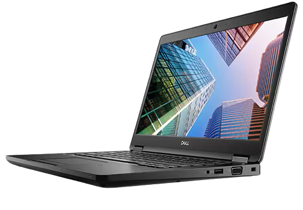
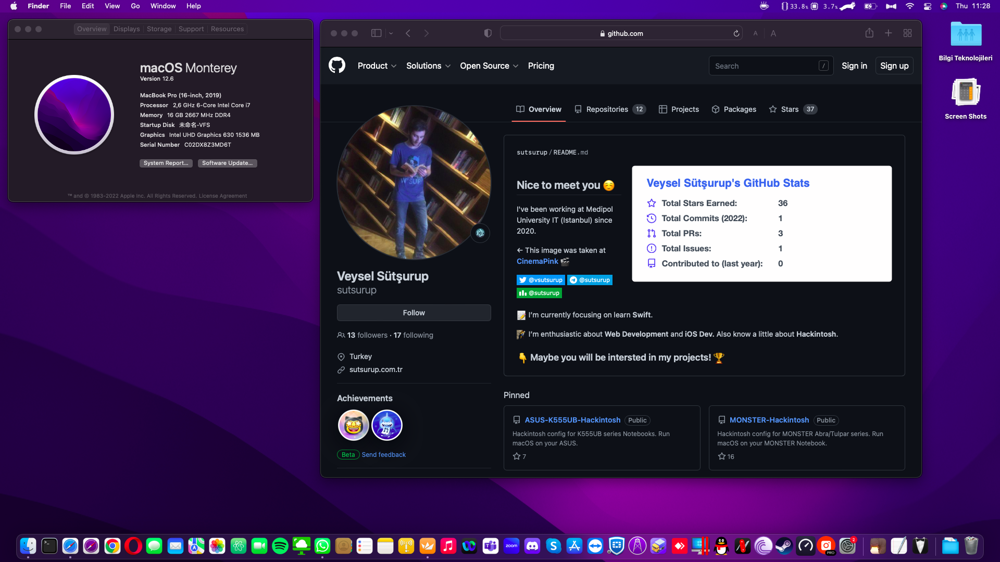

# DELL Latitude 5491 14" | Intel i7 (8850H)

[](https://www.apple.com/macos/monterey/)
[](https://github.com/acidanthera/OpenCorePkg)
[](https://github.com/sutsurup/DELL-Latitude-5491-Hackintosh/releases)



[Türkçe](README.md) | English

**macOS Version: 12.6**

**OpenCore Version: 0.8.6**

Helpful resources:

- [OpenCore Install Guide](https://dortania.github.io/OpenCore-Install-Guide)

# Details

    Date:         December 1, 2022
    Status:       Stable
    Support:      BIOS (1.23.0)
    Build:        OpenCore

## Hardware

| **DELL** | Detail                                                 |
| ------------------- | ------------------------------------------- |
| Model Name      | DELL Latitude 5491      |
| Motherboard       | DELL 0VGJ22     |
| CPU              | Intel(R) Core(TM) i7-8850H CPU @ 2.60GHz Coffee Lake              |
| RAM           | 2666 MHz 8GB + 2666 MHz 8GB SODIMM (Total: 16GB)   |
| Internal Graphics | Intel UHD Graphics 630                    |
| Wi-Fi | Intel(R) Wireless-AC 9560 160MHz (OpenIntelWireless Support)               |
| BIOS Version      | 1.23.0                   |


## Compatibility
It works on **macOS Monterey 12.6**. You can update up to version 12.6.
I have shared a zip file for the EFI folder in the Releases section. Create a folder named EFI on the disk partition reserved for EFI in your macOS installation media, and copy the BOOT and OC folders from the zip into the EFI folder.
You can also try running it on macOS High Sierra 10.13.6, Mojave 10.14.6, Catalina 10.15.7, and macOS Big Sur 11.x.

### Working

- [x] Sleep
- [x] Wi-Fi + Bluetooth (OpenIntelWireless, without HeliPort)
- [x] Audio and Microphone
- [x] Battery percentage indicator
- [x] TouchPad and macOS functions (Full)
- [x] Function keys (Fn)
- [x] Screen brightness

### Not Working
- [ ] SIM Card (Cellular - Sierra Wireless AirPrime)
- [ ] Ethernet (macOS does not boot when Ethernet is enabled in BIOS)
- [ ] HDMI (Not fully working)


## Post-Installation Guides
* **Recommended:** If you are going to log in to iCloud or want to use iMessage, FaceTime, follow this guide exactly: [Activating iMessage and Apple Services with OpenCore](https://osxinfo.net/konu/opencore-ile-imessage-ve-apple-servislerini-aktif-etmek.16297/) (Although this guide shows Clover Configurator, you will use OpenCore Configurator. Apply the steps to your `config.plist` file via OpenCore Configurator.)
* [ProperTree](https://osxinfo.net/konu/propertree-opencore-bootloader-icin-config-duzenleyici.12919/) (for editing `config.plist`)
* Hackintool ([Forum thread](https://www.insanelymac.com/forum/topic/335018-hackintool-v286/) | [Direct download link](http://headsoft.com.au/download/mac/Hackintool.zip)) (For detailed system information and adjustments)

## Contact and Support
If you have problems at any step, you can first use the [repo's Issues page](https://github.com/sutsurup/DELL-Latitude-5491-Hackintosh/issues) for support.

For other topics, you can reach out using the information below:
- **Website:** [sutsurup.tr](http://sutsurup.tr)
- **Mail:** [veysel@sutsurup.tr](mailto:veysel@sutsurup.tr)

## Screenshots


</details>

## Support
If you find the project useful, you can donate to help me with resource development:
```
₿ 1Q8CEMHTuecxPUJpEdpRiG6Bg2GVtzw4bN
```
<a href='https://github.com/sutsurup/sutsurup/blob/main/Donate.md'></a>
```
Click on the QR code to access alternative donation options.
```